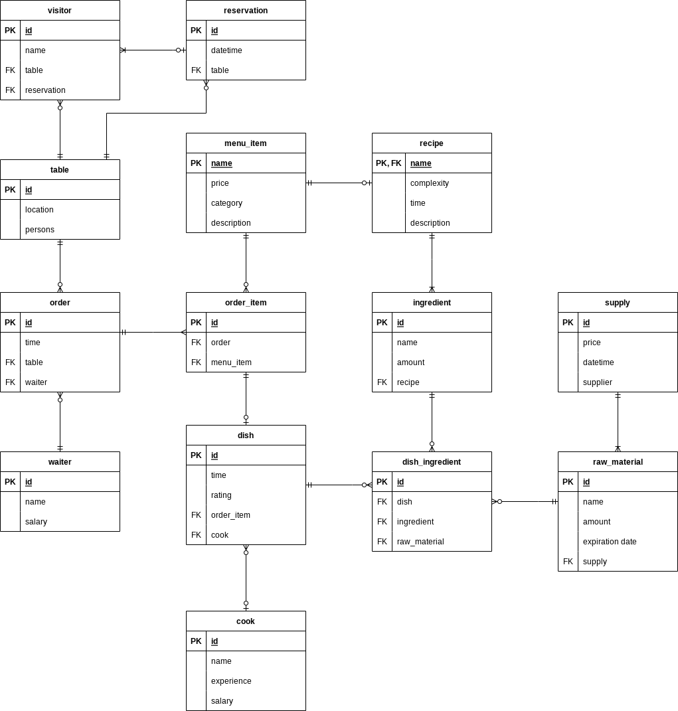
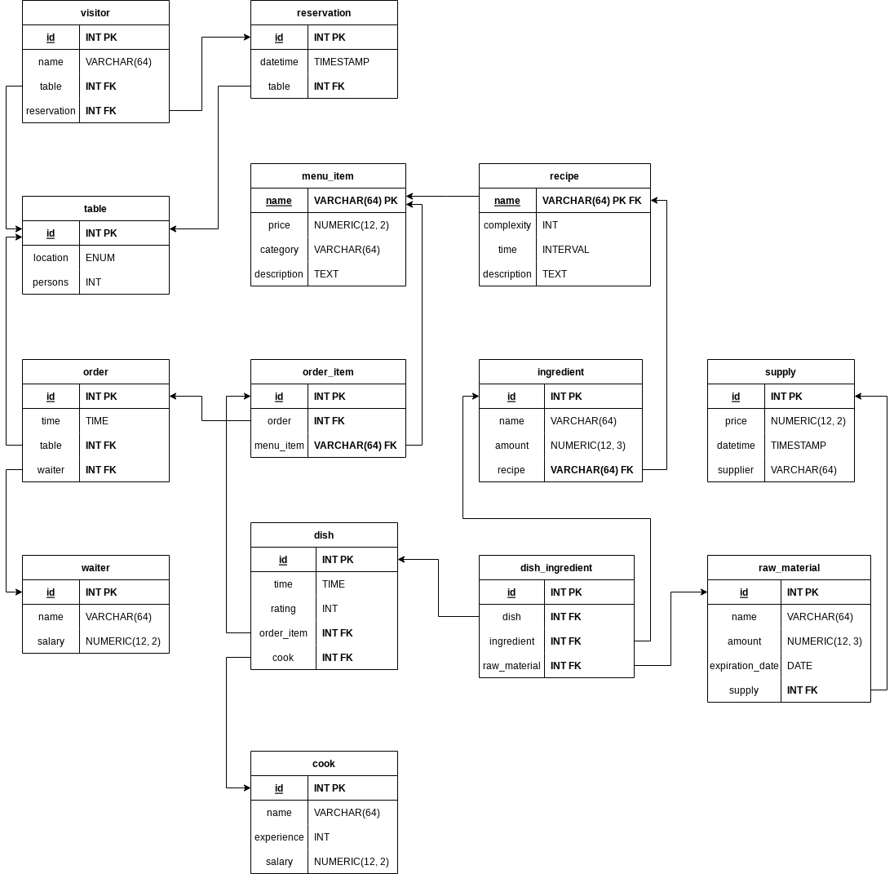

# Restaurant database
Project was created to improve the skills of creating SQL scripts 

## Scripts
- [Create database](create.sql)
- [Insert data to database](insert.sql)
- [Functions and triggers to maintain integrity](integrity.sql)
- [Indices for performance improvement](index.sql)

## Diagrams

### ER diagram

### Datalogical model

